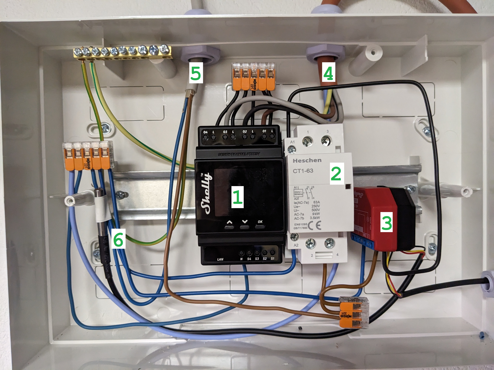

# !!!! This project ist still WIP. Heating rods use high voltage and temperatures. Use the content of this repository at your own risk !!!!

# shelly-smart-heater
Heating your water with a shelly, heating rod and solar power

## BOM
- Shelly 4PM Pro (~110 Euro)
- Shelly 1 PM Plus + Add-On (~38 Euro)
- 230V Relais 63A (~17 Euro)
- DS18B20 Sensors  (~5 Euro)
- DIN Rail Case (~15 Euro)
- Asko-Heat AHR-B-S Einschraubheizkörper R 1 1/2" AH 3 (~300 Euro)

## Wiring / Setup
Shelly 1 (3) switches the relais (2) which then powers the Shelly 4PM Pro (1). The Shelly 1 PM Plus (3) monitors the temperatures and turns of if temperatures exceed a critical value. This helps to prevent overheating because of software issues with the script running on the Shelly 4PM Pro (1). (5) is the incoming voltage line. (4) is the Askoma heating rod. (6) is just a temperature sensor to monitor cable temperatures.

## Code
The code receives the temperature values from the heating system, solar power and battery output power. Based on this values the script turns on switches 1-3. If no values received within 300s heating is stopped.
